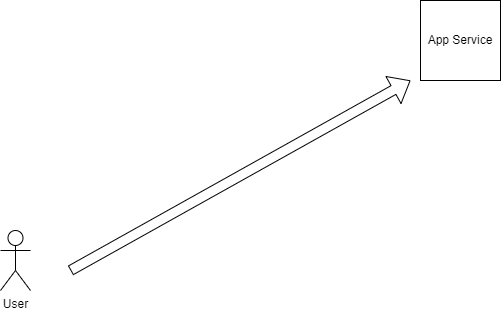

# 📘 Azure Quiz For cloud Concepts

## ✨ Overview

This Project is designed to test and imporve your knowlede of Microsoft Azure concepts, services, and best practise

## 🚀 Features

* Multiple choice questions

* Randomized quizzes

* Instant feedback on answers

* Score tracking

* Categories (e.g., Networking, Security, Compute, Storage)

##

## 🛠️ Technologies Used
- FastAPI: Python web framework for building the application and handling HTTP routes.

- Uvicorn: ASGI server for running the FastAPI app locally and on Azure App Service.
- Jinja2: Templating engine for rendering HTML templates (index.html, results.html).
- Python: Programming language (version 3.9 or higher) for the app’s backend logic.
- Python-Multipart: Library for parsing form data in FastAPI (used for quiz submission).
- Tailwind CSS: CSS framework (via CDN) for styling the quiz interface.
- HTML: Markup language for creating the web interface templates.
- Azure App Service: Cloud platform for deploying and hosting the app.
- Azure CLI: Command-line tool for deploying and managing the app on Azure.
- Git: Version control system for managing code and deploying to GitHub/Azure.
- VS Code: Integrated development environment for writing, testing, and deploying the app.

# 📦 Prerequsites

* Python 3.9 or higher: Download Python

* Git: Download Git

* Azure CLI: Install Azure CLI (for deployment)

* VS Code: Recommended for development and deployment (optional)

* Azure Account: Required for deployment to Azure App Service

## Architecture Diagram

